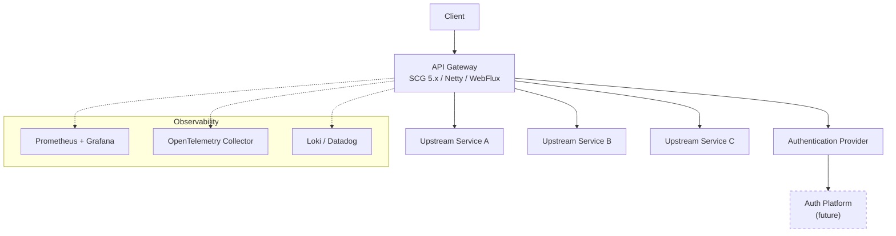
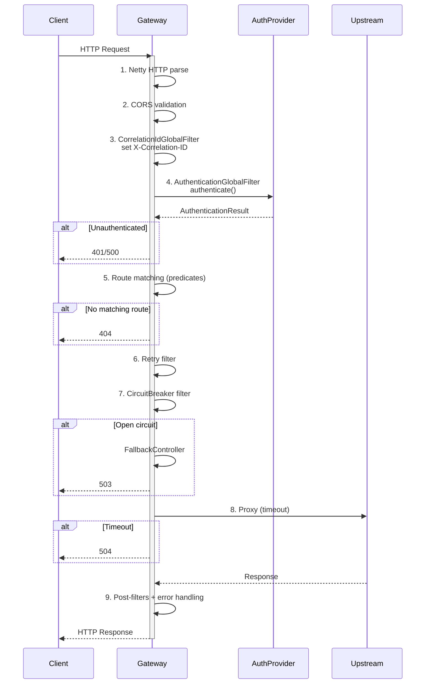
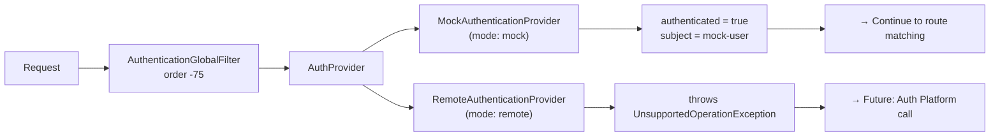

# API Gateway

Stateless, reactive front-door proxy for a microservices platform. Built with Spring Cloud Gateway 5.x on Java 26 — WebFlux, Netty, Reactor.

## Project Overview

The API Gateway is the single entry point for all external traffic into the platform's microservices ecosystem. It owns cross-cutting concerns so upstream services do not have to.

**Responsibilities**

- Route requests to the correct upstream service
- Authenticate every request before routing
- Inject and propagate correlation IDs
- Protect upstream services with circuit breakers, retries, and timeouts
- Emit structured JSON logs, metrics, and distributed traces
- Return consistent JSON error responses

**Deliberately out of scope**

- JWT validation or OAuth2 — the platform has no authorization layer yet; auth is a pluggable strategy
- TLS termination — delegated to the Kubernetes ingress
- API key management — deferred to V2
- Rate limiting — requires Redis, deferred to V2
- Dynamic route management — deferred to V2

## Key Features

- Request routing via declarative YAML predicates
- Pluggable authentication — mock mode for development, remote provider for production
- Correlation ID propagation (`X-Correlation-ID`)
- Circuit breaker, retry, and response timeout through SCG built-in filter factories
- Structured JSON logging (Log4j2 + JsonTemplateLayout)
- Prometheus metrics via Micrometer (`/actuator/prometheus`)
- Distributed tracing via OpenTelemetry (auto-instrumentation)
- Liveness and readiness health probes
- JSON error bodies for all HTTP error statuses (no HTML whitelabel)
- Docker multi-stage build with non-root user
- Docker Compose for local development

## High-Level Architecture



The gateway is stateless — every pod is identical. No Redis, no database, no local state.

## Request Lifecycle



| Phase | Mechanism | Error |
|-------|-----------|-------|
| 1 | Netty HTTP parser | 400 |
| 2 | `CorsGlobalFilter` | 403 |
| 3 | `CorrelationIdGlobalFilter` | — |
| 4 | `AuthenticationGlobalFilter` → `AuthenticationProvider` | 401 / 500 |
| 5 | SCG `RouteLocator` | 404 |
| 6 | SCG `RetryGatewayFilterFactory` | 502 |
| 7 | SCG `CircuitBreakerGatewayFilterFactory` + fallback | 503 |
| 8 | Netty `HttpClient` with response-timeout | 504 |
| 9 | Post-filters + `GlobalErrorHandler` | — |

## Package Structure

```
gateway/
├── config/   # Bean selection — decides which AuthenticationProvider to wire up
├── auth/     # Authentication strategy: interface, result record, mock impl, remote stub
├── filter/   # Custom GlobalFilter implementations (auth, correlation ID)
├── web/      # Fallback controller — structured 503 when circuit breaker is open
└── common/   # Shared error handler (JSON error body) and header constants
```

Dependency flow: `config → auth`, `filter → auth + common`, `web → common`, `common → (none)`. No circular dependencies.

**Custom classes: 11**. Everything else is YAML configuration or SCG built-in filters.

## Technology Stack

| Layer | Technology |
|-------|-----------|
| Language | Java 26 |
| Framework | Spring Boot 4.x, Spring Cloud Gateway 5.x |
| Runtime | WebFlux / Netty / Project Reactor |
| Authentication | Custom strategy pattern (interface + provider implementations) |
| Resilience | Resilience4j (circuit breaker, retry, timeout) via SCG filter factories |
| Logging | Log4j 2.x + JsonTemplateLayout (structured JSON to stdout) |
| Metrics | Micrometer + `micrometer-registry-prometheus` |
| Tracing | OpenTelemetry Java agent (auto-instrumentation) |
| Build | Maven 3.x (wrapped) |
| Container | Docker multi-stage build (`eclipse-temurin:26-jre`) |

## Configuration

Configuration follows Spring Boot's standard precedence: environment variables override `application.yml`. No custom `@ConfigurationProperties` classes — everything uses native Spring Boot keys.

| Key / Env Variable | Default | Description |
|--------------------|---------|-------------|
| `server.port` | `8000` | HTTP listen port |
| `gateway.authentication.provider` / `GATEWAY_AUTHENTICATION_PROVIDER` | `mock` | Authentication provider (`mock` or `remote`) |
| `GATEWAY_CORS_ORIGINS` | `https://app.example.com` | Allowed CORS origins |
| `spring.cloud.gateway.httpclient.response-timeout` | `5s` | Global upstream timeout |
| `spring.codec.max-in-memory-size` | `256KB` | Request body size limit |
| `DEFAULT_LOG_LEVEL` | `INFO` | Root log level |
| `GATEWAY_LOG_LEVEL` | `DEBUG` | `gateway.*` package log level |
| `OTEL_TRACES_EXPORTER` | `otlp` | OpenTelemetry trace exporter |

## Running Locally

**Requirements**

- Java 26 (JDK)
- Docker (optional, for containerized runs)

**Build and test**

```bash
./mvnw clean verify
```

Every push and pull request is automatically built via GitHub Actions — format check (`spotless:check`) followed by `clean verify`. This is build verification only; no artifacts are published or deployed.

**Run**

```bash
./mvnw spring-boot:run
```

The gateway starts on port 8000 with mock authentication (no Auth Platform needed).

**Docker**

```bash
docker build -t api-gateway .
docker run -p 8000:8000 -e GATEWAY_AUTHENTICATION_PROVIDER=mock api-gateway
```

**Docker Compose**

```bash
docker compose up --build
```

## Authentication

Every request goes through `AuthenticationGlobalFilter` (order -75) before route matching. The filter delegates to a configurable `AuthenticationProvider`.



| Mode | Provider | Behavior |
|------|----------|----------|
| `mock` (default) | `MockAuthenticationProvider` | Always returns `authenticated = true` with subject `"mock-user"`. Zero I/O — no HTTP, no JWT, no crypto. Suitable for local development and CI. |
| `remote` | `RemoteAuthenticationProvider` | Throws `UnsupportedOperationException`. Placeholder for future Auth Platform integration. Will call the Auth Platform's `/auth/validate` endpoint. |

Configure via `GATEWAY_AUTHENTICATION_PROVIDER` environment variable or `gateway.authentication.provider` in `application.yml`.

## Observability

### Metrics

Micrometer auto-configures Prometheus registry. Metrics are scraped at `/actuator/prometheus`:

| Metric | Source |
|--------|--------|
| `http.server.requests` | Spring WebFlux (Timer) |
| `resilience4j.circuitbreaker.*` | Resilience4j (Counter, Gauge) |
| `jvm.*` | JVM Micrometer (Various) |

No custom metrics code.

### Logging

Log4j 2.x writes structured JSON to stdout via `JsonTemplateLayout`. Each log event includes `timestamp`, `level`, `logger`, `message`, `correlationId`, `traceId`, `spanId`, and `exception`. Compatible with Loki, ELK, and Datadog.

### Tracing

OpenTelemetry Java agent auto-instruments the Netty HTTP server and client at runtime. Trace context propagates to upstream services via W3C `traceparent` headers. No custom tracing code.

### Correlation IDs

`CorrelationIdGlobalFilter` (order -100) generates an `X-Correlation-ID` if the request does not already carry one. The value is populated into the MDC as `correlationId` and appears in all structured log entries.

## Resilience

All resilience patterns use SCG built-in filter factories. No custom circuit breaker or retry code.

| Pattern | Mechanism | Trigger | Response |
|---------|-----------|---------|----------|
| Circuit Breaker | `CircuitBreakerGatewayFilterFactory` + Resilience4j | Failure rate exceeds 50% in sliding window of 10 | 503 + `FallbackController` (structured JSON) |
| Retry | `RetryGatewayFilterFactory` | Server error (5xx) on GET request | Transparent retry, max 3 attempts |
| Timeout | `HttpClient.response-timeout` per-route or global default | No response within configured window | 504 |

The `FallbackController` returns a JSON body with correlation ID, route name, and timestamp when the circuit breaker is open.

## Deployment

### Dockerfile

Multi-stage build:

| Stage | Image | Purpose |
|-------|-------|---------|
| Builder | `eclipse-temurin:26-jdk` | Compile and package |
| Runtime | `eclipse-temurin:26-jre` | Run the JAR as non-root user |

### Environment Variables

| Variable | Required | Default | Purpose |
|----------|----------|---------|---------|
| `GATEWAY_AUTHENTICATION_PROVIDER` | No | `mock` | Select auth provider |
| `GATEWAY_CORS_ORIGINS` | No | `https://app.example.com` | CORS allowed origins |
| `DEFAULT_LOG_LEVEL` | No | `INFO` | Root logger level |
| `OTEL_TRACES_EXPORTER` | No | `otlp` | OpenTelemetry exporter |
| `OTEL_SERVICE_NAME` | Recommended | — | Tracer service name |
| `JAVA_TOOL_OPTIONS` | No | — | JVM flags (heap, GC, agent) |

### Logging

Log4j 2.x writes structured JSON to stdout via `JsonTemplateLayout`. Level control via environment variables:

| Variable | Scope | Default |
|----------|-------|---------|
| `DEFAULT_LOG_LEVEL` | Root logger | `INFO` |
| `GATEWAY_LOG_LEVEL` | `gateway.*` package | `DEBUG` |

### Graceful Shutdown

- `server.shutdown=graceful` — drains in-flight requests before shutting down
- `spring.lifecycle.timeout-per-shutdown-phase=30s` — maximum drain window

## Gateway Routes

Routes are declared in `application.yml` and proxied by Spring Cloud Gateway.

| Method | Gateway Endpoint | Downstream Service | Routed URI | Description |
|--------|-----------------|-------------------|------------|-------------|
| GET | `/api/v1/templates` | templates-service | `http://localhost:8002/api/v1/templates` | Proxies to the templates service |

## Postman Collection

A Postman collection is available at `docs/postman/api-gateway.postman_collection.json`.

**Import**

1. Open Postman
2. File → Import → Upload Files → select the collection file
3. The `baseUrl` variable defaults to `http://localhost:8000`

**Folders**

| Folder | Purpose |
|--------|---------|
| Health | Gateway health probes and metrics endpoints |
| Authentication | Placeholder for future Auth Platform integration |
| Gateway | Requests proxied to downstream services through configured routes |
| Fallback | Local fallback endpoints invoked when a circuit breaker is open |

## Current Limitations

- `RemoteAuthenticationProvider` is a stub — it throws `UnsupportedOperationException` until the Auth Platform endpoint is available
- No rate limiting (requires Redis)
- No dynamic route management (requires Redis)
- No API key authentication
- No fine-grained authorization (roles, permissions — the `AuthenticationResult` record has fields for them but no provider populates them yet)

## Future Roadmap

- Auth Platform integration (replace mock with real token validation)
- Rate limiting with Redis
- API key authentication
- Dynamic route management with Redis
