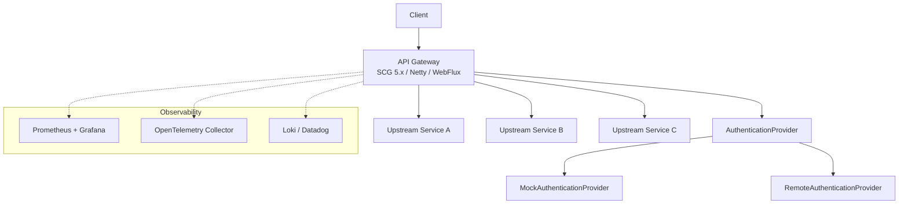
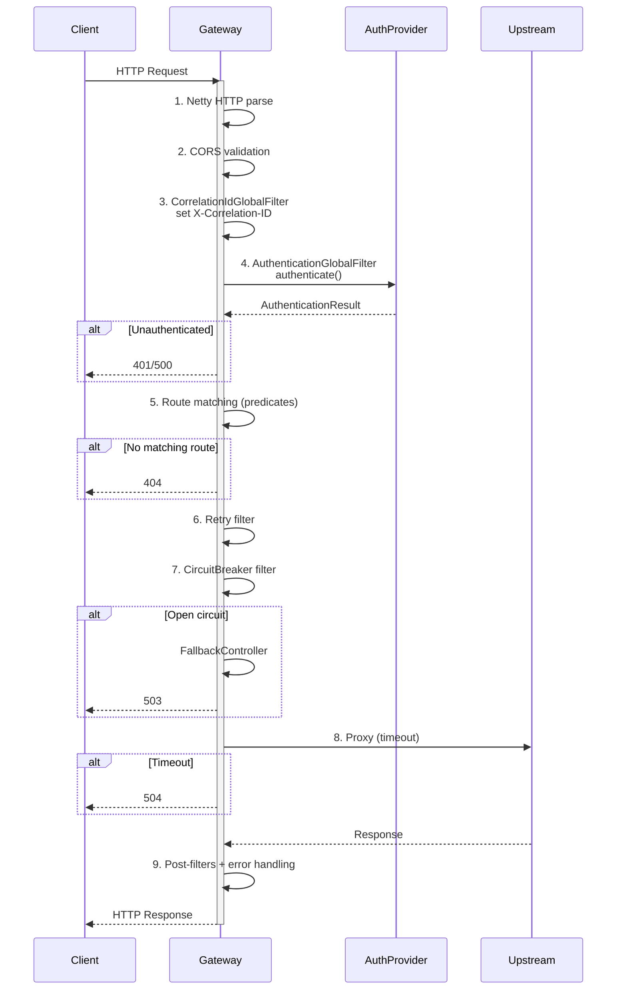
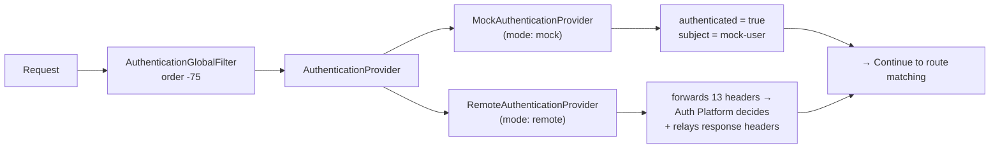

# API Gateway

Stateless, reactive front-door proxy for a microservices platform. Built with Spring Cloud Gateway 5.x on Java 26 - WebFlux, Netty, Reactor.

## Project Overview

The API Gateway is the single entry point for all external traffic into the platform's microservices ecosystem. It owns cross-cutting concerns so upstream services do not have to. The gateway is authentication-mechanism agnostic - it forwards the full authentication context to an external authentication platform without interpreting any credential format.

**Responsibilities**

- Route requests to the correct upstream service
- Authenticate every request before routing
- Inject and propagate correlation IDs
- Protect upstream services with circuit breakers, retries, and timeouts
- Emit structured JSON logs, metrics, and distributed traces
- Return consistent JSON error responses

**Deliberately out of scope**

- Authorization (JWT, OAuth2, API keys) - authentication is pluggable but no authorization layer is implemented
- TLS termination - delegated to the Kubernetes ingress
- Dynamic route management - routes are declared statically in YAML; dynamic route updates via API are not implemented

## Key Features

- Request routing via declarative YAML predicates
- Pluggable authentication - mock mode for development, remote provider for production
- Correlation ID propagation (`X-Correlation-ID`)
- Rate limiting via Redis-backed token bucket (SCG `RequestRateLimiter`)
- Circuit breaker with per-route configuration (Resilience4j via custom customizer)
- Retry and response timeout through SCG built-in filter factories
- Structured JSON logging (Log4j2 + JsonTemplateLayout)
- Prometheus metrics via Micrometer (`/actuator/prometheus`)
- Distributed tracing via OpenTelemetry (auto-instrumentation)
- JSON error bodies for all HTTP error statuses (no HTML whitelabel)
- Docker multi-stage build with non-root user
- Docker Compose for local development

## High-Level Architecture



Gateway pods are stateless and horizontally scalable - each pod is identical. Redis is used as an external dependency for rate-limiting state only; there is no database or local state within the gateway process. Authentication is delegated to a pluggable `AuthenticationProvider` abstraction with two implementations: `MockAuthenticationProvider` (always authenticates) and `RemoteAuthenticationProvider` (delegates to an external service).

## Request Lifecycle



| Phase | Mechanism | Error |
|-------|-----------|-------|
| 1 | Netty HTTP parser | 400 |
| 2 | `CorsGlobalFilter` | 403 |
| 3 | `CorrelationIdGlobalFilter` | - |
| 4 | `AuthenticationGlobalFilter` → `AuthenticationProvider` | 401 / 500 |
| 5 | SCG `RouteLocator` | 404 |
| 6 | SCG `RetryGatewayFilterFactory` | 502 |
| 7 | SCG `CircuitBreakerGatewayFilterFactory` + fallback | 503 |
| 8 | Netty `HttpClient` with response-timeout | 504 |
| 9 | Post-filters + `GlobalExceptionHandler` | - |

## Package Structure

```
gateway/
├── config/             # Bean selection, Redis configuration
├── auth/               # Authentication strategy: interface, result record, mock impl, remote impl
│   ├── dto/            # DTOs: AuthenticationHeaders, AuthenticationResult, AuthenticationClaims, AuthValidationRequest/Response
│   └── properties/     # RemoteAuthenticationProperties
├── filter/             # Custom GlobalFilter implementations (auth, correlation ID)
├── observability/      # Request timing filter, response header configuration
│   └── properties/     # RequestTimingProperties, ResponseHeadersProperties
├── ratelimit/          # Rate limiting key resolver
│   └── properties/     # RateLimitConfigurationProperties, RateLimiterConfiguration
├── resiliency/
│   └── circuitbreaker/ # Circuit breaker configuration, factory customizer
│       └── properties/ # CircuitBreakerProperties
├── web/                # Fallback controller - structured 503 when circuit breaker is open
└── common/
    ├── exception/      # GlobalExceptionHandler, ErrorResponse, ErrorCode, ExceptionMapper
    └── util/           # HeaderConstants
```

Dependency flow: `config → auth`, `filter → auth + common`, `observability → filter + common`, `web → common`, `common → (none)`. No circular dependencies.

**Custom classes: 30**. Everything else is YAML configuration or SCG built-in filters.

## Technology Stack

| Layer | Technology |
|-------|-----------|
| Language | Java 26 |
| Framework | Spring Boot 4.x, Spring Cloud Gateway 5.x |
| Runtime | WebFlux / Netty / Project Reactor |
| Authentication | Custom strategy pattern (interface + provider implementations) |
| Resilience | Resilience4j (circuit breaker, retry, timeout) via SCG filter factories |
| Logging | Log4j 2.x + JsonTemplateLayout (structured JSON to stdout) |
| Metrics | Micrometer + `micrometer-registry-prometheus` |
| Tracing | OpenTelemetry Java agent (auto-instrumentation) |
| Build | Maven 3.x (wrapped) |
| Container | Docker multi-stage build (`eclipse-temurin:26-jre`) |

## Architecture Decisions

Detailed design documentation for the major infrastructure decisions is available in the `docs/design/` directory:

| Document | Covers |
|----------|--------|
| [Rate Limiting](docs/design/rate-limiting.md) | Algorithm selection (token bucket vs. fixed window, sliding window log, leaky bucket), Redis vs. in-memory trade-offs, key resolution strategy, horizontal scaling, failure modes, and performance characteristics |
| [Circuit Breaker](docs/design/circuit-breaker.md) | State machine lifecycle, Resilience4j vs. Hystrix analysis, per-route configuration merge pattern, SCG filter integration, default parameter rationale, and operational considerations |

These documents follow an Architecture Decision Record (ADR) style, explaining not only how each feature works but why the specific technologies and design choices were made.

## Configuration

Configuration follows Spring Boot's standard precedence: environment variables override `application.yml`. Custom `@ConfigurationProperties` classes are used for the `gateway.*` namespace.

| Key / Env Variable | Default | Description |
|--------------------|---------|-------------|
| `server.port` | `8000` | HTTP listen port |
| `gateway.authentication.provider` / `GATEWAY_AUTHENTICATION_PROVIDER` | `mock` | Authentication provider (`mock` or `remote`) |
| `GATEWAY_CORS_ORIGINS` | `https://app.example.com` | Allowed CORS origins |
| `TEMPLATE_SERVICE_URL` | `http://localhost:8002` | Downstream URI for the template service |
| `spring.cloud.gateway.httpclient.response-timeout` | `5s` | Global upstream timeout |
| `spring.codec.max-in-memory-size` | `256KB` | Request body size limit |
| `DEFAULT_LOG_LEVEL` | `INFO` | Root log level |
| `GATEWAY_LOG_LEVEL` | `DEBUG` | `gateway.*` package log level |
| `OTEL_TRACES_EXPORTER` | `otlp` | OpenTelemetry trace exporter |
| `gateway.authentication.remote.relay-response-headers` | `Authorization, Set-Cookie` | Response headers relayed from auth platform |
| `gateway.circuit-breaker.enabled` | `false` | Enables custom circuit breaker configuration |
| `gateway.rate-limit.enabled` | `false` | Enables rate limiting infrastructure |
| `gateway.circuit-breaker.defaults.sliding-window-size` | `10` | Number of requests in the sliding window |
| `gateway.circuit-breaker.defaults.minimum-number-of-calls` | `5` | Minimum calls before failure rate evaluation |
| `gateway.circuit-breaker.defaults.failure-rate-threshold` | `50` | Failure rate percentage that opens the circuit |
| `gateway.circuit-breaker.defaults.wait-duration-in-open-state` | `30s` | Time before attempting half-open |
| `gateway.circuit-breaker.defaults.permitted-number-of-calls-in-half-open-state` | `3` | Trial requests in half-open state |
| `gateway.circuit-breaker.defaults.automatic-transition-from-open-to-half-open-enabled` | `true` | Auto-transition to half-open |
| `gateway.circuit-breaker.defaults.slow-call-rate-threshold` | `100` | Slow call rate threshold |
| `gateway.circuit-breaker.defaults.slow-call-duration-threshold` | `60s` | Duration above which a call is considered slow |

## Running Locally

**Requirements**

- Java 26 (JDK)
- Docker (optional, for containerized runs)

**Build and test**

```bash
./mvnw clean verify
```

Every push and pull request is automatically built via GitHub Actions - format check (`spotless:check`) followed by `clean verify`. This is build verification only; no artifacts are published or deployed.

**Run**

```bash
./mvnw spring-boot:run
```

The gateway starts on port 8000 with mock authentication by default.

**Docker**

```bash
docker build -t api-gateway .
docker run -p 8000:8000 -e GATEWAY_AUTHENTICATION_PROVIDER=mock api-gateway
```

**Docker Compose**

```bash
docker compose up --build
```

### Container Networking

Downstream service URIs (e.g. `TEMPLATE_SERVICE_URL`) must resolve from inside the API Gateway container. Which address to use depends on where the downstream service runs:

| Downstream location | Example URI | When to use |
|---|---|---|
| Host machine (Gateway in Docker) | `http://host.docker.internal:8002` | Gateway runs in a container, downstream service runs directly on the host (Docker Desktop for Mac/Windows). `host.docker.internal` resolves to the host from within the container. |
| Same Docker network | `http://template-service:8002` | Both the Gateway and the downstream service run as Docker containers on the same user-defined bridge network. Compose service names resolve via built-in DNS. |
| Direct execution | `http://localhost:8002` | Gateway runs via `mvn spring-boot:run` (no container). `localhost` refers to the same machine - the downstream service is accessible directly. |

The `docker-compose.yml` sets `TEMPLATE_SERVICE_URL=http://host.docker.internal:8002` by default. Override it when running both services in Docker:

```bash
TEMPLATE_SERVICE_URL=http://template-service:8002 docker compose up --build
```

## Authentication

Authentication is delegated to a pluggable `AuthenticationProvider` abstraction. Every request passes through `AuthenticationGlobalFilter` (order -75) before route matching, which calls the configured provider. The gateway is **authentication-mechanism agnostic** - it forwards the full authentication context (13 header fields) to the external service without interpreting Bearer, Basic, API key, Cookie, or any other credential format.



| Mode | Provider | Description |
|------|----------|-------------|
| `mock` (default) | `MockAuthenticationProvider` | Always returns `authenticated = true` with subject `"mock-user"`. Zero I/O - no HTTP, no JWT, no crypto. Suitable for local development and testing. |
| `remote` | `RemoteAuthenticationProvider` | Forwards the full authentication context (Authorization, Cookie, X-API-Key, and 10 forwarding headers) to an external authentication platform via `POST /internal/v1/auth/validate`. The gateway never interprets, decodes, or validates credentials - it passes the headers unchanged. After successful authentication, configured response headers from the auth platform are relayed to the client. When configured, `RemoteAuthenticationProvider` is wired automatically via `@ConditionalOnProperty`. |

Configure via `GATEWAY_AUTHENTICATION_PROVIDER` environment variable or `gateway.authentication.provider` in `application.yml`. Set to `mock` (default) for local development or `remote` for deployments with an external authentication service.

### Authentication Contract

The `RemoteAuthenticationProvider` calls `POST /internal/v1/auth/validate` on the external authentication platform.

**Request:**
```json
{
  "requestId": "corr-123",
  "headers": {
    "authorization": "Bearer eyJhbGci...",
    "apiKey": "ak-...",
    "cookie": "session=abc",
    "userAgent": "Mozilla/5.0",
    "xForwardedFor": "10.0.0.1",
    "xForwardedHost": "gateway.example.com",
    "xForwardedPort": "443",
    "xForwardedProto": "https",
    "xForwardedPrefix": "/api",
    "origin": "https://origin.example.com",
    "referer": "https://referer.example.com/page",
    "acceptLanguage": "en-US",
    "host": "gateway.example.com"
  }
}
```

**Response (authenticated):**
```json
{
  "authenticated": true,
  "claims": {
    "subject": "user-123",
    "username": "abhilash",
    "email": "abhilash@example.com",
    "roles": ["USER", "ADMIN"],
    "permissions": ["template.read", "template.write"],
    "tenantId": "tenant-001",
    "metadata": {}
  }
}
```

**Response (unauthenticated):**
```json
{
  "authenticated": false
}
```

The `AuthenticationClaims` record contains only identity and authorization information. Token lifecycle (expiry, refresh tokens, token status) is owned entirely by the Authentication Platform and never exposed to the Gateway.

### Response Header Relay

After successful authentication, the Gateway relays configured response headers from the Authentication Platform to the client response. This allows the auth platform to set session cookies, issue updated authorization tokens, or signal other authentication lifecycle events without the Gateway interpreting the values.

| Header | Default | Purpose |
|--------|---------|---------|
| `Authorization` | relayed | Updated bearer or basic token after re-authentication |
| `Set-Cookie` | relayed | Session cookies, refresh tokens, or other auth-related cookies |

The Gateway:
- Copies only headers listed in `relay-response-headers` from the auth platform response to the client response.
- Never logs sensitive header values (Authorization, Set-Cookie, Cookie, X-API-Key).
- Logs only the header names being relayed at DEBUG level.
- Ignores headers not in the configured list.
- Only relays headers on successful authentication (HTTP 200 with `authenticated: true`).

The Gateway never:
- Parses, decodes, or validates Bearer tokens.
- Decodes Basic authentication credentials.
- Inspects or interprets cookies.
- Determines whether a token refresh occurred.

### Configuration

```yaml
gateway:
  authentication:
    remote:
      relay-response-headers:
        - Authorization
        - Set-Cookie
```

The list is extensible - add any response header name to relay additional headers from the auth platform.

## Observability

### Metrics

Micrometer auto-configures Prometheus registry. Metrics are scraped at `/actuator/prometheus`:

| Metric | Source |
|--------|--------|
| `http.server.requests` | Spring WebFlux (Timer) |
| `resilience4j.circuitbreaker.*` | Resilience4j (Counter, Gauge) |
| `jvm.*` | JVM Micrometer (Various) |

No custom metrics code.

### Logging

Log4j 2.x writes structured JSON to stdout via `JsonTemplateLayout`. Each log event includes `timestamp`, `level`, `logger`, `message`, `correlationId`, `traceId`, `spanId`, and `exception`. Compatible with Loki, ELK, and Datadog.

### Tracing

OpenTelemetry Java agent auto-instruments the Netty HTTP server and client at runtime. Trace context propagates to upstream services via W3C `traceparent` headers. No custom tracing code.

### Correlation IDs

`CorrelationIdGlobalFilter` (order -100) generates an `X-Correlation-ID` if the request does not already carry one. The value is populated into the MDC as `correlationId`, propagated to downstream services as a request header, and returned to the client as a response header.

Response header injection is configurable under `gateway.observability.response-headers`:

| Key | Default | Description |
|-----|---------|-------------|
| `gateway.observability.response-headers.enabled` | `true` | Master switch for all response header injection |
| `gateway.observability.response-headers.correlation-id` | `true` | Whether to write `X-Correlation-ID` to the response |

When both are true, the filter registers a `response.beforeCommit` callback that sets the `X-Correlation-ID` response header exactly once. When disabled, no callback is registered and the header is omitted from the response.

The correlation ID is always propagated to downstream services as a request header regardless of this setting, and the exchange attribute and Reactor context are always populated.

### Request Timing

`RequestTimingGlobalFilter` (order -110) measures total request processing time for every request. It wraps around all other filters so the recorded duration includes correlation ID resolution, authentication, route matching, built-in filters (retry, circuit breaker), and the upstream proxy call.

On completion, the filter logs the method, path, status, duration in milliseconds, route ID, correlation ID, trace ID, and remote IP. Requests exceeding the `slow-request-threshold` are logged at WARN level; all others at INFO level.

Configured under `gateway.logging.request-timing`:

| Key | Default | Description |
|-----|---------|-------------|
| `gateway.logging.request-timing.enabled` | `true` | Enables the timing filter |
| `gateway.logging.request-timing.slow-request-threshold` | `1000ms` | Duration threshold above which a request is logged at WARN |

The filter is fully non-blocking (WebFlux), uses `System.nanoTime()` for precision, and never throws exceptions from the logging path.

## Rate Limiting

Rate limiting uses Spring Cloud Gateway's built-in `RequestRateLimiter` filter factory backed by `RedisRateLimiter`. The feature is **disabled by default** and has zero impact on existing routes until explicitly opted in.

### Architecture

```
                        ┌─────────────────────────────────┐
                        │     RateLimiterConfiguration     │
                        │  (loaded when enabled=true)      │
                        │                                  │
                        │  ┌──────────────────────────┐    │
                        │  │  gatewayKeyResolver       │    │
                        │  │  (KeyResolver)            │    │
                        │  └──────────────────────────┘    │
                        │  ┌──────────────────────────┐    │
                        │  │  redisRateLimiter          │    │
                        │  │  (RedisRateLimiter)        │    │
                        │  │  @ConditionalOnBean        │    │
                        │  └──────────────────────────┘    │
                        └─────────────────────────────────┘
                                  │
                                  │ controlled by
                                  ▼
                    ┌─────────────────────────┐
                    │  application.yml         │
                    │  gateway.rate-limit.*    │
                    └─────────────────────────┘
```

The `RateLimiterConfiguration` (package `gateway.ratelimit`) is conditionally activated by `@ConditionalOnProperty` when `gateway.rate-limit.enabled=true`. It registers:

- **`GatewayKeyResolver`** - resolves a rate limit key from each request
- **`RedisRateLimiter`** - the token-bucket rate limiter backed by Redis; created only when both `ReactiveRedisTemplate` and `StringRedisTemplate` beans are present (`@ConditionalOnBean`)

### Key Resolution Priority

The `GatewayKeyResolver` resolves the rate limit key in the following order, stopping at the first non-blank value:

1. **`X-API-Key`** header - ideal for API-key-based rate limiting
2. **Authenticated subject** - from the `AuthenticationResult` stored by `AuthenticationGlobalFilter`
3. **`X-Forwarded-For`** header - the leftmost (original client) IP in the chain
4. **Remote IP** - the direct socket address of the inbound connection
5. **`anonymous`** - fallback when none of the above are available

### Configuration

| Key | Default | Description |
|-----|---------|-------------|
| `gateway.rate-limit.enabled` | `false` | Master switch for rate limiting infrastructure |
| `gateway.rate-limit.replenish-rate` | `1` | Number of tokens added per second |
| `gateway.rate-limit.burst-capacity` | `1` | Maximum burst size (bucket depth) |
| `gateway.rate-limit.requested-tokens` | `1` | Tokens consumed per request |
| `gateway.rate-limit.deny-empty-key` | `true` | Whether to deny requests with an empty rate limit key |
| `gateway.rate-limit.empty-key-status` | `401` | HTTP status returned when empty key is denied |

### Redis Configuration

The `RedisRateLimiter` requires a running Redis instance. The following beans are already configured in `RedisConfig` (`gateway.config`):

- `LettuceConnectionFactory` - standalone without SSL (`local` profile) or cluster with TLS and connection pooling (`!local` profile)
- `RedisTemplate<String, String>` - with `StringRedisSerializer` and a JSON-capable default serializer
- `RedisSerializer<Object>` - custom Jackson-based serializer with type metadata (`ObjectMapperRedisSerializer`)

### Enabling Rate Limiting

**Step 1:** Enable the infrastructure:

```yaml
gateway:
  rate-limit:
    enabled: true
    replenish-rate: 10
    burst-capacity: 20
    requested-tokens: 1
```

**Step 2:** Ensure Redis is configured and running.

**Step 3:** Opt in per-route by adding the `RequestRateLimiter` filter:

```yaml
spring:
  cloud:
    gateway:
      routes:
        - id: my-protected-route
          uri: http://upstream:8080
          predicates:
            - Path=/api/v1/protected/**
          filters:
            - name: RequestRateLimiter
              args:
                key-resolver: "#{@gatewayKeyResolver}"
                rate-limiter: "#{@redisRateLimiter}"
```

The `key-resolver` and `rate-limiter` SpEL expressions reference the beans registered by `RateLimiterConfiguration`. No existing routes are affected - each route that needs rate limiting must explicitly add the filter.

## Resilience

The circuit breaker infrastructure uses a custom `CircuitBreakerFactoryCustomizer` (package `gateway.resiliency.circuitbreaker`) to pre-configure the `Resilience4JCircuitBreakerFactory` with both default and per-route circuit breaker configurations. Per-route configs merge with defaults, so routes only need to specify overrides.

| Pattern | Mechanism | Trigger | Response |
|---------|-----------|---------|----------|
| Circuit Breaker | `CircuitBreakerGatewayFilterFactory` + Resilience4j | Failure rate exceeds 50% in sliding window of 10 | 503 + `FallbackController` (structured JSON) |
| Retry | `RetryGatewayFilterFactory` | Server error (5xx) on GET request | Transparent retry, max 3 attempts |
| Timeout | `HttpClient.response-timeout` per-route or global default | No response within configured window | 504 |

### Configuration

Circuit breaker settings are defined under `gateway.circuit-breaker` with a `defaults` block and a `routes` map:

```yaml
gateway:
  circuit-breaker:
    enabled: true
    defaults:
      sliding-window-size: 10
      failure-rate-threshold: 50
      wait-duration-in-open-state: 30s
      permitted-number-of-calls-in-half-open-state: 3
    routes:
      template-service:
        enabled: true
        circuit-breaker-name: template-service
        sliding-window-size: 5
        failure-rate-threshold: 25
```

| Key | Default | Description |
|-----|---------|-------------|
| `gateway.circuit-breaker.enabled` | `false` | Master switch for custom circuit breaker configuration |
| `gateway.circuit-breaker.defaults.*` | see below | Default config applied to all routes |
| `gateway.circuit-breaker.routes.<id>.*` | inherits from defaults | Per-route overrides |

Default circuit breaker config values:

| Property | Default |
|----------|---------|
| `sliding-window-size` | `10` |
| `minimum-number-of-calls` | `5` |
| `failure-rate-threshold` | `50` |
| `wait-duration-in-open-state` | `30s` |
| `permitted-number-of-calls-in-half-open-state` | `3` |
| `automatic-transition-from-open-to-half-open-enabled` | `true` |
| `slow-call-rate-threshold` | `100` |
| `slow-call-duration-threshold` | `60s` |

The `CircuitBreakerFactoryCustomizer` implements `Consumer<Resilience4JCircuitBreakerFactory>` and is registered by `CircuitBreakerConfiguration` when `gateway.circuit-breaker.enabled=true`. It configures the default `Resilience4JCircuitBreakerFactory` with the properties from `CircuitBreakerProperties`.

### Per-Route Configuration

Routes can override individual defaults. Values not explicitly set inherit from the `defaults` block. For example, with the config above, `template-service` would use:
- `sliding-window-size = 5` (override)
- `failure-rate-threshold = 25` (override)
- `wait-duration-in-open-state = 30s` (inherited)

To use the custom configuration on a route, reference the standard SCG `CircuitBreaker` filter factory:

```yaml
spring:
  cloud:
    gateway:
      routes:
        - id: template-service
          uri: http://upstream:8080
          predicates:
            - Path=/api/v1/templates/**
          filters:
            - name: CircuitBreaker
              args:
                name: template-service
                fallbackUri: forward:/fallback
```

The `name` in the filter args must match a key in `gateway.circuit-breaker.routes` for the per-route configuration to take effect.

The `FallbackController` returns a JSON body with correlation ID, route name, and timestamp when the circuit breaker is open.

## Deployment

### Dockerfile

Multi-stage build:

| Stage | Image | Purpose |
|-------|-------|---------|
| Builder | `eclipse-temurin:26-jdk` | Compile and package |
| Runtime | `eclipse-temurin:26-jre` | Run the JAR as non-root user |

### Environment Variables

| Variable | Required | Default | Purpose |
|----------|----------|---------|---------|
| `GATEWAY_AUTHENTICATION_PROVIDER` | No | `mock` | Select auth provider (`mock` or `remote`) |
| `GATEWAY_AUTHENTICATION_REMOTE_BASE_URL` | No | `http://localhost:8004` | Remote auth platform base URL (used when provider is `remote`) |
| `GATEWAY_CORS_ORIGINS` | No | `https://app.example.com` | CORS allowed origins |
| `TEMPLATE_SERVICE_URL` | No | `http://localhost:8002` | Downstream URI for the template service |
| `DEFAULT_LOG_LEVEL` | No | `INFO` | Root logger level |
| `GATEWAY_LOG_LEVEL` | No | `DEBUG` | `gateway.*` package log level |
| `OTEL_TRACES_EXPORTER` | No | `otlp` | OpenTelemetry exporter |
| `OTEL_SERVICE_NAME` | No | `api-gateway` | Tracer service name |
| `JAVA_TOOL_OPTIONS` | No | - | JVM flags (heap, GC, agent) |
| `GATEWAY_RATE_LIMIT_ENABLED` | No | `false` | Enables rate limiting infrastructure |
| `GATEWAY_RATE_LIMIT_REPLENISHRATE` | No | `1` | Tokens added per second |
| `GATEWAY_RATE_LIMIT_BURSTCAPACITY` | No | `1` | Maximum burst size |
| `GATEWAY_RATE_LIMIT_REQUESTEDTOKENS` | No | `1` | Tokens consumed per request |
| `GATEWAY_RATE_LIMIT_DENYEMPTYKEY` | No | `true` | Deny requests with empty rate limit key |
| `GATEWAY_RATE_LIMIT_EMPTYKEYSTATUS` | No | `401` | HTTP status for empty key denial |
| `GATEWAY_AUTHENTICATION_REMOTE_RELAYRESPONSEHEADERS` | No | `Authorization,Set-Cookie` | Comma-separated response headers to relay from auth platform |
| `GATEWAY_CIRCUIT_BREAKER_ENABLED` | No | `false` | Enables custom circuit breaker configuration |

### Logging

Log4j 2.x writes structured JSON to stdout via `JsonTemplateLayout`. Level control via environment variables:

| Variable | Scope | Default |
|----------|-------|---------|
| `DEFAULT_LOG_LEVEL` | Root logger | `INFO` |
| `GATEWAY_LOG_LEVEL` | `gateway.*` package | `DEBUG` |

### Graceful Shutdown

- `server.shutdown=graceful` - drains in-flight requests before shutting down
- `spring.lifecycle.timeout-per-shutdown-phase=30s` - maximum drain window

## Gateway Routes

Routes are declared in `application.yml` and proxied by Spring Cloud Gateway.

| Method | Gateway Endpoint | Downstream Service | Routed URI | Description |
|--------|-----------------|-------------------|------------|-------------|
| GET | `/api/v1/templates` | templates-service | `http://localhost:8002/api/v1/templates` | Proxies to the templates service |

## Postman Collection

A Postman collection is available at `docs/postman/api-gateway.postman_collection.json`.

**Import**

1. Open Postman
2. File → Import → Upload Files → select the collection file
3. The `baseUrl` variable defaults to `http://localhost:8000`

**Folders**

| Folder | Purpose |
|--------|---------|
| Actuator | Gateway health probes and metrics endpoints |
| Authentication | External authentication platform API (not on the gateway itself) |
| Gateway | Requests proxied to downstream services through configured routes |
| Fallback | Local fallback endpoints invoked when a circuit breaker is open |
