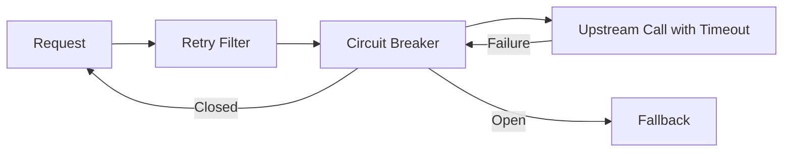
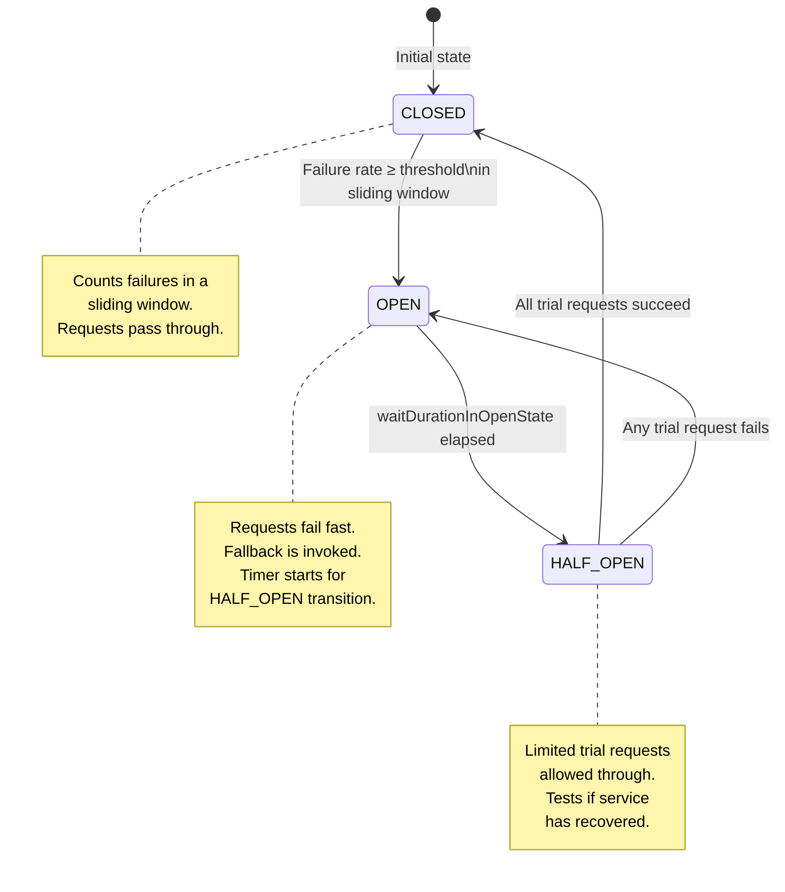
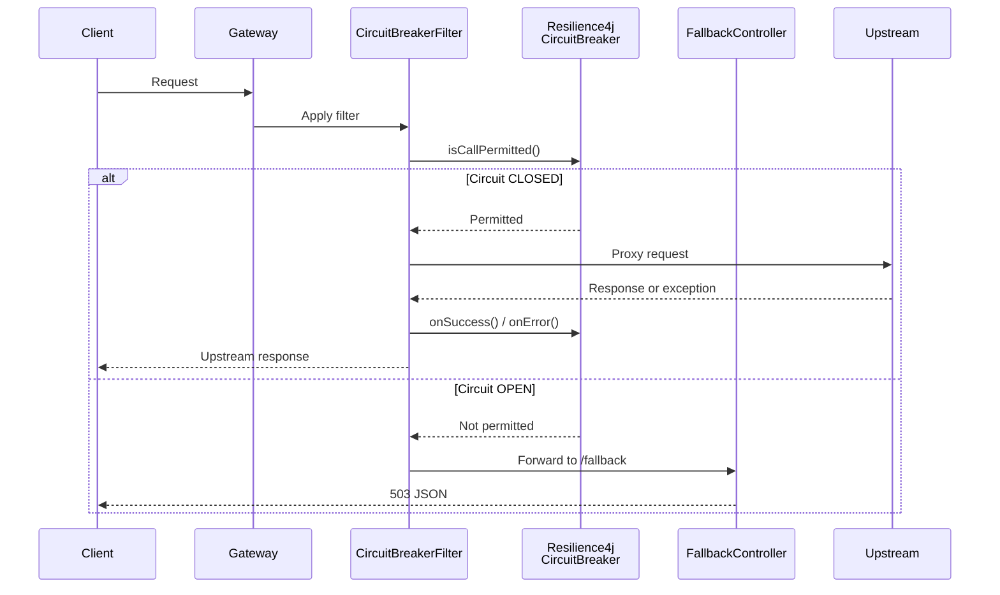

# Circuit Breaker Architecture

- [Problem Statement](#problem-statement)
- [Why a Gateway Should Implement Circuit Breaking](#why-a-gateway-should-implement-circuit-breaking)
- [Timeout vs. Retry vs. Circuit Breaker](#timeout-vs-retry-vs-circuit-breaker)
- [Technology Choices](#technology-choices)
  - [Spring Cloud CircuitBreaker](#spring-cloud-circuitbreaker)
  - [Resilience4j](#resilience4j)
  - [Why Resilience4j Instead of Hystrix](#why-resilience4j-instead-of-hystrix)
- [Circuit Breaker Lifecycle](#circuit-breaker-lifecycle)
  - [State Definitions](#state-definitions)
  - [State Transition Diagram](#state-transition-diagram)
  - [Transition Rules](#transition-rules)
- [Configuration Rationale](#configuration-rationale)
- [Per-Route Configuration (Merge Pattern)](#per-route-configuration-merge-pattern)
- [Integration with Spring Cloud Gateway](#integration-with-spring-cloud-gateway)
- [Failure Scenarios](#failure-scenarios)
- [Operational Considerations](#operational-considerations)
- [Performance Impact](#performance-impact)
- [Future Extensibility](#future-extensibility)

---

## Problem Statement

A gateway that proxies requests to upstream services must handle the reality that upstream services can fail, degrade, or become unresponsive. Without protection, a failing upstream service causes cascading effects:

- Gateway worker threads block waiting for upstream responses that never arrive (or arrive too late).
- Connection pools to the failing service become saturated with pending requests.
- Retry logic, intended to improve reliability, amplifies load on an already-struggling service.
- The gateway itself exhausts resources and becomes unable to serve requests for healthy services.

The circuit breaker pattern addresses this by monitoring for failures and, when a threshold is crossed, short-circuiting requests to the failing service so they fail fast instead of waiting for a timeout.

---

## Why a Gateway Should Implement Circuit Breaking

Circuit breaking is often implemented in service meshes (e.g., Istio, Linkerd) or client-side libraries (e.g., Resilience4j, Hystrix) within each service. The gateway is an additional - and critical - enforcement point for three reasons:

1. **Last line of defense**: The gateway is the final hop before a request leaves the infrastructure boundary. If downstream services fail to implement circuit breaking (e.g., a new service that was not written with resilience patterns), the gateway provides a safety net.
2. **Cross-service visibility**: The gateway sees traffic for all upstream services. It can detect when an entire service class is degrading - something a single downstream service cannot see - and prevent traffic to that service.
3. **Preventing gateway resource exhaustion**: A failing upstream service can still consume gateway resources (connection pool slots, worker threads, memory buffers). Short-circuiting at the gateway releases these resources immediately instead of holding them until an upstream timeout fires.

Circuit breaking at the gateway complements, rather than replaces, circuit breaking within each service. They operate at different levels:

- **Service-level**: Protects the service's own resources from its callers.
- **Gateway-level**: Protects the gateway's resources and prevents traffic from reaching a failing service.

---

## Timeout vs. Retry vs. Circuit Breaker

These three resilience patterns are often confused. They address different failure modes and operate at different time scales:

| Pattern | Failure Mode | Action | Time Scale |
|---------|-------------|--------|-----------|
| **Timeout** | Upstream is slow but responsive | Stop waiting after a deadline; release the thread | Per-request (milliseconds to seconds) |
| **Retry** | Upstream fails transiently (network glitch, restarting) | Try again with backoff | Per-request (milliseconds to minutes) |
| **Circuit Breaker** | Upstream is failing persistently (down, overloaded, buggy code) | Stop sending requests entirely; fail fast | Multi-request (seconds to minutes) |

A timeout prevents a single request from hanging indefinitely. A retry handles the case where a timeout or transient failure is followed by success. A circuit breaker prevents the combination of timeouts and retries from overwhelming a failing service.

The three patterns compose in the SCG filter chain:



Retry attempts to recover from transient failures. If the retries also fail, the circuit breaker records the failures. When the failure rate exceeds the threshold, the circuit breaker opens and subsequent requests bypass the upstream entirely.

---

## Technology Choices

### Spring Cloud CircuitBreaker

Spring Cloud CircuitBreaker is an abstraction layer that provides a consistent API over multiple circuit breaker implementations (Resilience4j, Sentinel, Hystrix). It was chosen because:

- **SCG integration**: Spring Cloud Gateway has a `CircuitBreakerGatewayFilterFactory` that integrates directly with Spring Cloud CircuitBreaker. Adding the `CircuitBreaker` filter to a route definition in YAML is sufficient to wrap upstream calls.
- **Provider abstraction**: The abstraction allows switching the circuit breaker implementation without changing route definitions. If a future requirement demands a different provider (e.g., Sentinel for adaptive concurrency limiting), only the dependency and auto-configuration need to change.
- **Factory customization**: The `Resilience4JCircuitBreakerFactory` exposes a `configureDefault()` and `configure()` API that allows programmatic configuration of default and per-circuit-breaker settings. This is the hook used by `CircuitBreakerFactoryCustomizer`.

The alternative was using `Resilience4j` directly without the SC CircuitBreaker abstraction. This was rejected because it would bypass SCG's built-in filter factory, requiring a custom `GatewayFilter` to wrap upstream calls - duplicating functionality that SCG already provides.

### Resilience4j

Resilience4j was selected as the circuit breaker provider because:

- **Lightweight**: Resilience4j is a single-JAR library with no external dependencies beyond SLF4J and Vavr. It has no Netflix dependencies and no servlet container requirements.
- **Reactor support**: Resilience4j provides `reactor.core.publisher.Mono` and `Flux` operators (`CircuitBreakerOperator.of()`), which integrate natively with Spring Cloud Gateway's WebFlux/Reactor stack without blocking.
- **Thread-safe**: All Resilience4j components are thread-safe and designed for concurrent access, which is essential in a reactive environment where multiple event loop threads may access the same circuit breaker state.
- **Fine-grained configuration**: Every circuit breaker parameter is independently configurable with sensible defaults. The `CircuitBreakerConfig` builder pattern allows customizing each parameter while inheriting defaults for the rest.
- **Production maturity**: Resilience4j is the successor to Hystrix, adopted by Spring Cloud as the default circuit breaker provider since Spring Cloud Greenwich. It has extensive production usage in the Spring ecosystem.

The decision to use Resilience4j through Spring Cloud CircuitBreaker rather than directly was driven by the SCG integration - SCG's `CircuitBreakerGatewayFilterFactory` expects the `CircuitBreakerFactory` abstraction, not a raw Resilience4j `CircuitBreaker`.

### Why Resilience4j Instead of Hystrix

Hystrix was the original circuit breaker library in the Netflix OSS stack, but it has been in **maintenance mode** since 2018. The decision not to use it was based on:

| Aspect | Hystrix | Resilience4j |
|--------|---------|--------------|
| Maintenance | **End of life** (maintenance mode since 2018) | **Active development** (v2.x with Spring Boot 4.x support) |
| Architecture | Uses thread pools per circuit breaker; requires thread context switching | **Thread-agnostic**: works with any execution model (sync, async, reactive) |
| Runtime | Requires Hystrix thread pools; consumes a thread per circuit breaker | No thread management; overhead is CPU-bound only |
| Reactive support | **None** - blocking only | **Native Reactor support** (`CircuitBreakerOperator`) |
| Dependencies | Pulls in Netflix archaius, servlet API, and the entire Hystrix JAR family | **Zero external dependencies** beyond SLF4J and Vavr |
| Configuration | Property files / archaius dynamic properties | **Fluent Java API** via `CircuitBreakerConfig.custom()`, also supports `@ConfigurationProperties` |
| Thread isolation | Thread pool or semaphore | Not required (thread-agnostic) |

Hystrix's thread pool isolation model is designed for blocking servlet containers. In a reactive, non-blocking environment like Spring Cloud Gateway (Netty/WebFlux), thread pools are antithetical to the architecture - they introduce context switching, increase memory pressure, and cannot be used with Reactor's event loop without breaking the reactive pipeline. Resilience4j's thread-agnostic design makes it the only viable choice for reactive gateways.

---

## Circuit Breaker Lifecycle

### State Definitions

A Resilience4j circuit breaker exists in one of three states:

| State | Meaning | Request Handling |
|-------|---------|-----------------|
| **CLOSED** | Service is healthy. Failures are counted but requests pass through. | Requests are proxied normally. Failures increment the failure count. |
| **OPEN** | Failure threshold exceeded. | Requests are rejected immediately with a `CircuitBreakerOpenException`. A fallback is invoked. |
| **HALF_OPEN** | Probation period after OPEN. A configurable number of requests are allowed through to test if the service has recovered. | If the trial requests succeed, the circuit transitions to CLOSED. If any trial request fails, it transitions back to OPEN. |

### State Transition Diagram



### Transition Rules

**CLOSED → OPEN**: The transition occurs when the failure rate exceeds `failureRateThreshold` within a sliding window of `slidingWindowSize` calls, and at least `minimumNumberOfCalls` have been recorded. This prevents the circuit from tripping on a small sample of calls.

**OPEN → HALF_OPEN**: After `waitDurationInOpenState` has elapsed from the OPEN transition, the circuit breaker transitions to HALF_OPEN. If `automaticTransitionFromOpenToHalfOpenEnabled` is true, this transition happens automatically via a scheduled thread. If false, the transition occurs only when a new request triggers the state check.

**HALF_OPEN → CLOSED**: All `permittedNumberOfCallsInHalfOpenState` trial requests must succeed. If any trial request fails, the circuit returns to OPEN and the `waitDurationInOpenState` timer restarts.

**HALF_OPEN → OPEN**: Any failure during the trial period immediately reverts the circuit to OPEN. This prevents a partially recovered service from receiving the full traffic load.

---

## Configuration Rationale

The `CircuitBreakerConfiguration` class defines default values for all circuit breaker parameters. These defaults are chosen to provide sensible behavior for a gateway proxying typical HTTP microservices:

### Failure Rate Threshold (`failureRateThreshold` = 50%)

The circuit opens when 50% of requests fail. This means a service must have more successes than failures to stay closed. A 50% threshold is conservative enough to tolerate transient blips (e.g., a single connection reset affecting a few requests) while aggressive enough to trip before the service is completely overwhelmed.

Lower values (e.g., 25%) would trip on relatively minor degradation, potentially causing unnecessary fallback invocations. Higher values (e.g., 75%) would allow a mostly-failing service to continue receiving traffic, defeating the purpose of the circuit breaker.

### Sliding Window Size (`slidingWindowSize` = 10)

The circuit breaker evaluates the failure rate over the last 10 requests (count-based sliding window, not time-based). A count-based window was chosen over a time-based window because:

- **Predictable behavior**: The circuit trips after a fixed number of failures, regardless of traffic volume. A time-based window would trip faster under high traffic and slower under low traffic, making behavior dependent on request arrival rate.
- **Low-traffic safety**: For a service with low traffic (e.g., 1 request/minute), a time-based window of 30 seconds would evaluate only a few requests before the window slides. A count-based window of 10 ensures enough data points before making a decision.

The window size of 10 balances statistical significance with responsiveness. A smaller window (e.g., 5) would trip faster but on weaker evidence. A larger window (e.g., 20) would require more failures to trip, potentially overloading the service during the accumulation period.

### Minimum Number of Calls (`minimumNumberOfCalls` = 5)

The circuit breaker ignores failure rates until at least 5 calls have been recorded in the sliding window. This prevents the circuit from tripping on the first few requests after a restart or during a brief traffic blip.

With `slidingWindowSize = 10` and `minimumNumberOfCalls = 5`, the circuit needs at least 5 of 10 requests to fail (with 50% threshold) before tripping. This means at least 3 failing requests out of 5-10 total.

### Wait Duration in Open State (`waitDurationInOpenState` = 30s)

After the circuit opens, it remains open for 30 seconds before transitioning to HALF_OPEN. This duration is chosen to:

- Allow time for a typical microservice to restart (most deployments complete within 30 seconds).
- Prevent rapid cycling between OPEN and CLOSED/HALF_OPEN.
- Provide enough time for the operational team to observe alerts and investigate.

Shorter durations (e.g., 5-10 seconds) would cause rapid state cycling, potentially overwhelming a recovering service. Longer durations (e.g., 60+ seconds) would keep traffic blocked longer than necessary after a service recovers.

### Permitted Number of Calls in Half-Open State (`permittedNumberOfCallsInHalfOpenState` = 3)

When the circuit is HALF_OPEN, exactly 3 trial requests are allowed through. If all 3 succeed, the circuit closes. If any fails, the circuit reopens.

Three trial requests provide a reasonable sample size for determining recovery. A single trial request could succeed by chance (e.g., a load balancer routing to a single healthy instance while others remain down). More than 3 would increase the risk of overloading a partially recovered service with trial traffic.

### Automatic Transition to Half-Open (`automaticTransitionFromOpenToHalfOpenEnabled` = true)

Automatic transition was enabled to ensure the circuit breaker tests recovery without waiting for user traffic. If disabled, the circuit remains OPEN until a new request triggers the transition, which could delay recovery detection for low-traffic routes.

### Slow Call Threshold (`slowCallRateThreshold` = 100%, `slowCallDurationThreshold` = 60s)

By default, slow calls are not counted as failures (rate threshold at 100%) because the primary failure detection is response-based. A response that arrives within the timeout is considered successful regardless of latency. If slow-call detection is needed (e.g., for a service that degrades gradually by becoming slower before failing), these thresholds can be adjusted per-route.

The 60-second slow call duration threshold is intentionally high - it matches the upstream response timeout in the SCG `HttpClient` configuration. If an upstream call takes longer than 60 seconds, it will time out and be counted as a failure rather than a slow call.

---

## Per-Route Configuration (Merge Pattern)

The `CircuitBreakerProperties` supports hierarchical configuration with inheritance:

```yaml
gateway:
  circuit-breaker:
    defaults:
      sliding-window-size: 10
      minimum-number-of-calls: 5
      failure-rate-threshold: 50
      wait-duration-in-open-state: 30s
    routes:
      template-service:
        enabled: true
        circuit-breaker-name: template-service
        sliding-window-size: 20
```

The merge logic in `CircuitBreakerConfiguration.merge()` implements the following rules:

1. If both `defaults` and `overrides` are null, return null.
2. If `overrides` is null, return `defaults` unchanged.
3. If `defaults` is null, return `overrides` unchanged.
4. Otherwise, for each configurable field, use the override value if non-null; fall back to the default value.

This merge pattern was chosen over hierarchical configuration binding (which Spring Boot supports via `@ConfigurationProperties(ignoreUnknownFields = false)`) because:

- **Null-means-inherit semantics**: Fields set to null in a route override inherit from defaults. This is the natural behavior for hierarchical configuration.
- **Different default types**: Some fields are primitives (which cannot be null in Java) and some are boxed types. The properties class uses boxed types (`Integer`, `Float`, `Boolean`) to distinguish "not configured" (null) from "configured to zero" (0).
- **No SpEL required**: Route overrides are plain YAML without SpEL expressions or property placeholders.

The `CircuitBreakerFactoryCustomizer` applies the merge in two steps:

```
1. Configure factory default: buildConfig(defaults)
2. For each enabled route with a circuit-breaker-name:
     a. merged = merge(defaults, routeConfig)
     b. factory.configure(builder -> builder.circuitBreakerConfig(buildConfig(merged)), routeName)
```

The order matters - the default configuration is registered first, then per-route configurations override specific circuit breaker names. The `Resilience4JCircuitBreakerFactory` uses the route name (from the SCG `CircuitBreaker` filter's `name` argument) to look up the per-route configuration. If no per-route configuration exists, the default configuration is used.

---

## Integration with Spring Cloud Gateway

The circuit breaker is applied through Spring Cloud Gateway's `CircuitBreakerGatewayFilterFactory` in route definitions:

```yaml
filters:
  - name: CircuitBreaker
    args:
      name: template-service
      fallbackUri: forward:/fallback
```

The filter wraps the upstream call in the Resilience4j circuit breaker. When the circuit is OPEN, the filter does not make the upstream call - it short-circuits directly to the `fallbackUri`.

The `FallbackController` at `/fallback` returns a structured JSON response:

```json
{
  "timestamp": "2026-07-15T20:28:25.192Z",
  "status": 503,
  "correlationId": "abc-123",
  "route": "template-service",
  "message": "Upstream service is temporarily unavailable"
}
```

The `circuitBreakerName` in the per-route configuration must match the `name` argument in the filter's YAML. This is the key that `Resilience4JCircuitBreakerFactory` uses to resolve the circuit breaker configuration. If no matching per-route configuration exists, the factory default is used.



---

## Failure Scenarios

| Scenario | Behavior | Mitigation |
|----------|----------|------------|
| Upstream returns HTTP 5xx | Response is recorded as a failure by Resilience4j. Failure count increments. | Configure route-specific thresholds. Monitor circuit breaker state changes via Resilience4j metrics. |
| Upstream connection timeout | The SCG `HttpClient.response-timeout` fires. This is recorded as an exception by Resilience4j. | Same as above. The timeout is separately configurable via `spring.cloud.gateway.httpclient.response-timeout`. |
| Upstream connection refused | Netty reports `ConnectionRefusedException`. Recorded as a failure. | Circuit trips quickly (within a few requests). Monitor for rapid state cycling. |
| Circuit breaker transitions to OPEN | Subsequent requests fail fast with `CircuitBreakerOpenException`. | Fallback controller returns 503. Operator receives alert from Resilience4j metrics. |
| Circuit breaker transitions to HALF_OPEN | Limited trial requests proceed to upstream. | If the upstream fails again, circuit returns to OPEN. Timer restarts. |
| Resilience4j throws internal exception | The exception is wrapped by Resilience4j and propagated through the filter chain. The filter does not catch it. | Global error handler returns a 500 response. This should not happen in normal operation. |

---

## Operational Considerations

**Metrics**: Resilience4j automatically exposes metrics through Micrometer when `micrometer-registry-prometheus` is on the classpath. Key metrics:

- `resilience4j.circuitbreaker.state` - Gauge indicating the current state (0=CLOSED, 1=OPEN, 2=HALF_OPEN).
- `resilience4j.circuitbreaker.calls` - Counter for successful, failed, and ignored calls.
- `resilience4j.circuitbreaker.buffered` - Gauge for the number of buffered calls in the sliding window.
- `resilience4j.circuitbreaker.failure.rate` - Gauge for the current failure rate.

These metrics should be scraped by Prometheus and alerted on:

- `circuitbreaker.state == 1` (OPEN) for more than 5 minutes indicates a persistent upstream failure requiring investigation.
- Rapid transitions between OPEN and CLOSED (> 3 transitions per minute) indicate an unstable upstream that may need a longer `waitDurationInOpenState`.

**Logging**: Resilience4j logs circuit breaker state changes at INFO level. The `CircuitBreakerFactoryCustomizer` does not add additional logging to avoid noise. Circuit breaker state transitions can also be emitted through Resilience4j's event publisher for custom event handling.

**Testing**: The circuit breaker can be tested by configuring a route to an intentionally failing upstream and observing the state transition:

1. Send requests to the route; observe them failing.
2. After `minimumNumberOfCalls` failures, the circuit opens.
3. Verify subsequent requests return 503 from the fallback.
4. Wait `waitDurationInOpenState` seconds and verify the circuit transitions to HALF_OPEN.
5. If the upstream has recovered, the circuit closes; if not, it reopens.

**Performance tuning**: The default parameters are suitable for most HTTP microservices. Adjust `sliding-window-size` based on the request rate:
- High-traffic routes (>100 req/s): Use a larger window (e.g., 20-50) for more stable failure rate estimation.
- Low-traffic routes (<1 req/s): Use a smaller window (e.g., 5) and lower `minimumNumberOfCalls` to trip faster.

---

## Performance Impact

- **CLOSED state overhead**: Resilience4j checks a volatile state variable and increments an atomic counter. The CPU cost is negligible (<1 microsecond).
- **OPEN state overhead**: The circuit breaker returns an exception immediately without any I/O. The fallback controller processes the request locally. This is significantly faster than waiting for an upstream timeout.
- **HALF_OPEN state overhead**: Same as CLOSED - state checks and counter updates are fast. The trial requests proceed to the upstream, incurring normal proxy latency.
- **No thread pool overhead**: Unlike Hystrix, Resilience4j does not allocate threads. The circuit breaker state is managed in-memory with atomic operations on the event loop thread.
- **Memory per circuit breaker**: Each `CircuitBreaker` instance stores a ring buffer of `slidingWindowSize` entries (approximately 8-16 bytes per entry plus object overhead). For 100 circuit breakers with `slidingWindowSize = 10`, memory usage is approximately 10-20 KB - negligible.

The performance impact of circuit breaking at the gateway is primarily a reduction in latency for failing requests: instead of waiting 5 seconds for an upstream timeout, the client receives a 503 response in under 1 millisecond.

---

## Future Extensibility

**Dynamic configuration**: Resilience4j supports dynamic configuration updates through `@ConfigurationProperties` binding. Adding `@RefreshScope` to the configuration or using Spring Cloud Config would allow changing circuit breaker parameters without restarting the gateway.

**Bulkhead isolation**: Resilience4j also provides a bulkhead pattern that limits concurrent calls to a service. This could be added alongside the circuit breaker to limit the number of in-flight requests to an upstream, preventing connection pool exhaustion even when the circuit is closed.

**Event-driven alerts**: Resilience4j's `CircuitBreakerEventPublisher` can be used to emit custom events for monitoring systems. For example, forwarding circuit breaker state changes to a webhook or logging structured events for analysis.

**Per-instance circuit breakers**: The current implementation creates one circuit breaker per route name. For services running multiple instances behind a load balancer, per-instance circuit breakers (e.g., using instance metadata from discovery) would allow failing over individual instances rather than the entire service.

**Automatic fallback customization**: The `FallbackController` returns a generic 503 response. Future iterations could return cached responses, degrade functionality, or return stale data from a cache, depending on the route's requirements.
