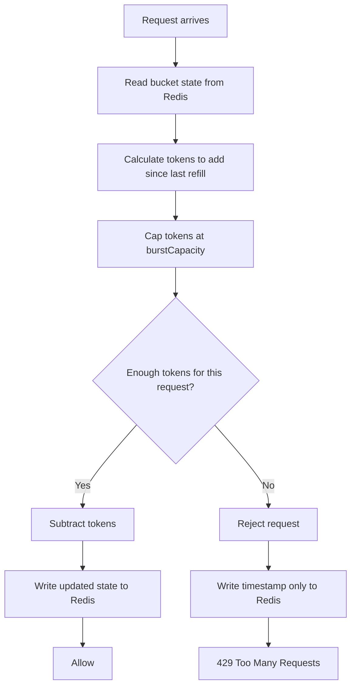
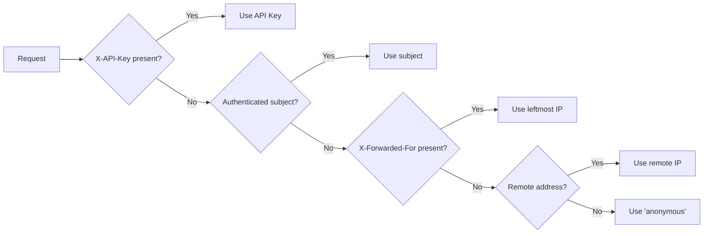

# Rate Limiting Architecture

- [Problem Statement](#problem-statement)
- [Why Rate Limiting at the Gateway](#why-rate-limiting-at-the-gateway)
- [Technology Choices](#technology-choices)
  - [Spring Cloud Gateway RequestRateLimiter](#spring-cloud-gateway-requestratelimiter)
  - [RedisRateLimiter](#redisratelimiter)
  - [Redis as the Backing Store](#redis-as-the-backing-store)
- [Algorithm: Token Bucket](#algorithm-token-bucket)
  - [How It Works](#how-it-works)
  - [Why Token Bucket Instead of Alternatives](#why-token-bucket-instead-of-alternatives)
  - [Algorithm Comparison Table](#algorithm-comparison-table)
- [Key Resolution](#key-resolution)
  - [GatewayKeyResolver](#gatewaykeyresolver)
  - [Resolution Priority Rationale](#resolution-priority-rationale)
- [Horizontal Scaling](#horizontal-scaling)
- [Failure Scenarios](#failure-scenarios)
- [Operational Considerations](#operational-considerations)
- [Performance Characteristics](#performance-characteristics)
- [Extensibility](#extensibility)

---

## Problem Statement

An API gateway handling production traffic must protect itself and its upstream services from overload, whether caused by a misconfigured client, a buggy retry loop, or a malicious actor. Without rate limiting, a single aggressive consumer can saturate the gateway's worker threads, exhaust connection pools, and induce cascading failures across downstream services.

The specific requirements for this implementation are:

- Enforce per-client request quotas at the gateway boundary before requests reach upstream services.
- Operate correctly across multiple gateway replicas (horizontal scaling).
- Use a well-understood algorithm that provides predictable, burst-friendly behavior.
- Minimize latency overhead - the rate-limiting decision must be faster than a typical upstream call.
- Allow per-route opt-in so existing routes are unaffected until explicitly configured.

---

## Why Rate Limiting at the Gateway

Pushing rate limiting downstream to each service duplicates effort and creates coverage gaps:

1. **Shared fate**: A downstream service that is already saturated may be unable to enforce its own rate limits, defeating the purpose.
2. **Operational overhead**: Every service must implement, configure, and monitor its own rate limiting, multiplying maintenance burden.
3. **Inconsistent policy**: Different teams may choose different algorithms and thresholds, making it impossible to reason about system capacity holistically.
4. **Cost efficiency**: Rejecting a request at the gateway costs a few milliseconds. Allowing it to traverse the network, be deserialized, authenticated, and processed by an upstream service before being rejected costs orders of magnitude more.

The gateway is the natural enforcement point because it sees all traffic, owns authentication, and has the lowest latency path to the client.

---

## Technology Choices

### Spring Cloud Gateway RequestRateLimiter

Spring Cloud Gateway provides a built-in `RequestRateLimiterGatewayFilterFactory` that implements the rate-limiting filter pattern. This was chosen over a custom `GlobalFilter` for several reasons:

- **Standardization**: The filter integrates with Spring Cloud Gateway's filter lifecycle, route definitions, and actuator endpoints. It appears in the route definition dump and can be observed through standard SCG metrics.
- **Pluggability**: The filter accepts a `KeyResolver` and a `RateLimiter` as arguments. This allows the algorithm and key strategy to vary independently, and both can be replaced without changing the route definition.
- **SpEL binding**: Route YAML references resolver and rate-limiter beans via SpEL (`#{@gatewayKeyResolver}`), keeping route configuration declarative.
- **No custom filter code**: The built-in filter handles the request interception, rate-limit check, and HTTP 429 response. Custom code is limited to the resolver and the rate-limiter bean.

A custom `GlobalFilter` was considered but rejected because it would duplicate the filter lifecycle integration that SCG already provides, and would require manual metric tracking and error response formatting.

### RedisRateLimiter

The `RedisRateLimiter` is Spring Cloud Gateway's production-ready rate limiter implementation backed by Redis. It was chosen over writing a custom `RateLimiter` implementation because:

- **Token bucket implementation**: It implements the token bucket algorithm using Redis Lua scripting, which is atomic, efficient, and well-tested across many production deployments.
- **No algorithm code to maintain**: The Lua script handles token replenishment, consumption, and burst capacity in a single round-trip. Implementing the same logic correctly in Java would require careful handling of atomicity and race conditions across replicas.
- **Configuration via constructor**: The rate limiter accepts `replenishRate`, `burstCapacity`, and `requestedTokens` directly in its constructor, making configuration straightforward through the `@ConfigurationProperties` binding.
- **Metrics integration**: SCG's `RedisRateLimiter` exposes metrics through the Micrometer `MeterRegistry` (when configured), recording tokens remaining and requests allowed/denied.

The `RedisRateLimiter` requires a running Redis instance. This was an acceptable trade-off because Redis is already a standard component in production microservice architectures, and the operational cost is justified by the correctness guarantees it provides.

### Redis as the Backing Store

Rate limiter state could be stored in local memory within each gateway instance. This was rejected because:

| Aspect | Local Memory | Redis |
|--------|-------------|-------|
| Consistency across replicas | None - each instance has its own counter | Global - all instances share a single counter |
| Burst behavior with N replicas | Each replica allows burst, so effective burst = N × configured burst | Single bucket, exact burst enforcement |
| State on restart | Lost - counters reset to zero | Preserved - state survives restarts |
| Scalability | Tied to single instance memory | Independent - Redis cluster can scale separately |
| Latency | Sub-microsecond | Sub-millisecond (local network) |

For a single-instance deployment, local memory would be simpler and faster. However, production deployments of the gateway run multiple replicas behind a load balancer. Without a shared counter, a client rotating through N replicas would get N times the configured rate. Redis provides the shared counter with predictable latency and no impact on request throughput for the gateway's primary concern: proxying requests upstream.

---

## Algorithm: Token Bucket

### How It Works

The `RedisRateLimiter` implements the token bucket algorithm using a Redis Lua script. The bucket is modeled as two Redis keys per rate-limit key:

- `{key}.tokens` - The current number of tokens in the bucket (float).
- `{key}.timestamp` - The last refill timestamp in seconds (long).

The Lua script runs atomically on every request:

```
1. Read {key}.tokens and {key}.timestamp from Redis.
2. Calculate elapsed time since last refill: Δt = now - timestamp.
3. Compute tokens to add: replenishRate × Δt.
4. Set tokens = min(burstCapacity, tokens + added).
5. Set timestamp = now.
6. If tokens >= requestedTokens:
     a. tokens = tokens - requestedTokens
     b. Write updated tokens and timestamp to Redis.
     c. Return {allowed: true, tokensRemaining: tokens}
7. Else:
     a. Write updated timestamp to Redis (tokens unchanged).
     b. Return {allowed: false, tokensRemaining: tokens}
```



The token bucket combines a **constant refill rate** (smoothing) with the ability to **accumulate unused capacity** (bursting). A client that sends requests at a steady rate below the replenish rate will never be throttled. A client that is idle for a period accumulates tokens up to `burstCapacity` and can then send that many requests in a burst, after which the bucket is drained and the steady-state rate applies.

### Why Token Bucket Instead of Alternatives

#### Fixed Window

**How it works**: Divide time into fixed intervals (e.g., 1 second). Count requests in each interval. Reset the counter at the start of each interval.

**Why not chosen**: Fixed window creates a "boundary problem" - a burst of requests at the end of one window combined with a burst at the start of the next window can double the effective rate. For example, with a limit of 10 requests per second, a client can send 10 requests at 0.999s and 10 more at 1.001s, effectively achieving 20 requests in a 2-millisecond span.

#### Sliding Window Log

**How it works**: Maintain a sorted log of timestamps for each request from a given key. Count entries within the sliding window on every request.

**Why not chosen**: The sliding window log provides exact enforcement but requires O(n) storage and O(log n) lookup per request, where n is the number of requests in the window. For high-traffic keys, this incurs unbounded memory growth and degrades performance. The log must also be pruned, adding periodic cleanup overhead. Redis would need to store and sort a sorted set per key, which increases network payload size and Redis CPU usage.

#### Sliding Window Counter

**How it works**: Approximate sliding window by weighting the previous window's counter. At time `t`, the effective count is `weight × prevCounter + currCounter`, where `weight = (windowDuration - elapsed) / windowDuration`.

**Why not chosen**: This is a compromise algorithm that avoids the storage cost of sliding window logs but sacrifices accuracy. At the boundary between windows, the approximation can over- or under-count depending on request distribution. For rate limiting where precision matters (e.g., API billing), this approximation is undesirable.

#### Leaky Bucket

**How it works**: Requests enter a FIFO queue and are processed at a fixed rate. If the queue is full, the request is rejected.

**Why not chosen**: The leaky bucket enforces a strict outflow rate with no bursting capability. A client that has been idle cannot accelerate when traffic resumes - every request is processed at the fixed rate regardless of recent activity. This punishes well-behaved clients that respect the rate most of the time and need occasional bursts. Token bucket provides the same smoothing but allows bursts up to the bucket capacity.

### Algorithm Comparison Table

| Algorithm | Burst Allowed | Boundary Error | Storage per Key | CPU per Request | Implementation in Redis |
|-----------|--------------|----------------|-----------------|-----------------|------------------------|
| Token Bucket | Yes (up to capacity) | None | 2 values (float, long) | O(1) | Lua script |
| Fixed Window | Yes (double at boundaries) | Yes (up to 2×) | 1 value (int) | O(1) | Simple INCR/EXPIRE |
| Sliding Window Log | Yes | None | O(n) timestamps | O(log n) | ZADD/ZCOUNT/ZREMRANGE |
| Sliding Window Counter | Approximate | Small | 2 values (int, int) | O(1) | Lua script |
| Leaky Bucket | No | None | 1 value (queue size) | O(1) | Lua script |

Token bucket was chosen because it provides:

- **Exact enforcement** (no boundary error).
- **Burst support** up to a configurable capacity.
- **Constant storage** - two Redis values regardless of traffic volume.
- **O(1) complexity** per request.
- **Well-understood behavior** - the algorithm is documented in networking textbooks and used by production systems including AWS, Stripe, and GitHub.

---

## Key Resolution

### GatewayKeyResolver

The `GatewayKeyResolver` implements Spring Cloud Gateway's `KeyResolver` interface, which maps each `ServerWebExchange` to a rate-limit key string. The key determines which bucket is checked - all requests sharing the same key compete for the same token bucket.

The resolver is a no-dependency class (except SLF4J for logging) with a single `resolve` method that returns `Mono<String>`.

### Resolution Priority Rationale

The resolver checks five sources in order, returning the first non-blank value:



**1. X-API-Key (highest priority)**

The `X-API-Key` header is checked first because it is the most precise identifier. API keys are provisioned per client, making them the ideal rate-limit key for billing-tier enforcement. When present, the key directly maps to the consumer's contractual rate limit.

**2. Authenticated subject**

If no API key is present but the request has been authenticated (the `AuthenticationGlobalFilter` runs at order -75, before route matching), the authenticated subject (e.g., username, service account) is used. This covers API clients that authenticate via JWT or mTLS but do not send an API key header.

The resolver accesses the `AuthenticationResult` stored as an exchange attribute by `AuthenticationGlobalFilter`. Only subjects from successfully authenticated requests (`authenticated = true`) are used - an unauthenticated result falls through to the next source.

**3. X-Forwarded-For**

When neither an API key nor an authenticated subject is available - for example, anonymous or unauthenticated requests - the resolver falls back to the client IP. The `X-Forwarded-For` header is preferred over the direct remote address because it carries the original client IP through proxy layers.

The resolver takes the **leftmost** IP address in the chain, which represents the original client. This follows the standard convention for `X-Forwarded-For` parsing.

**4. Remote IP**

If no proxy headers are present, the resolver uses the direct socket remote address. This is the IP address of the immediate TCP connection, which may be a load balancer or reverse proxy rather than the original client.

**5. anonymous (fallback)**

If none of the above sources produce a value, the key resolves to the literal string `"anonymous"`. This ensures the rate limiter never receives an empty key (which would be rejected by the `deny-empty-key: true` configuration). All unidentifiable traffic shares a single anonymous bucket, preventing unbounded resource consumption from unknown sources.

**Priority ordering rationale**: The priority moves from most specific (API key → authenticated subject) to least specific (proxy IP → direct IP → anonymous). This ensures that identifiable clients always get their own bucket while catch-all protection exists for unidentifiable traffic. The trade-off is that anonymous traffic shares a single quota, which could be exhausted by a single aggressive anonymous client - this is acceptable because anonymous requests are typically low-value and should have a strict limit.

---

## Horizontal Scaling

The architecture scales horizontally by relying on Redis as the shared counter store:

- **All gateway instances** read and write the same Redis keys through the same Lua script.
- **No instance-local state** - each request is evaluated against the global bucket.
- **Leader election is not required** - the Lua script provides atomicity; there is no critical section that requires a mutex or distributed lock.
- **Redis cluster mode** - for production deployments, `application.yml` supports `spring.data.redis.*` cluster configuration through the `RedisClusterConfiguration` in `RedisConfig`. Sharding distributes rate-limit keys across cluster nodes based on the key hash.

The Redis connection pool in `RedisConfig` is configured with:
- Connection pooling via `LettucePoolingClientConfiguration`
- TLS with peer verification disabled (certificate management delegated to the infrastructure)
- A 2-second timeout for both connection and read operations

In a multi-datacenter deployment, each datacenter should have its own Redis cluster with independent rate-limit counters. Cross-datacenter synchronization is an application-level concern beyond the scope of this implementation.

---

## Failure Scenarios

| Scenario | Behavior | Mitigation |
|----------|----------|------------|
| Redis connection timeout | Lua script throws an exception; the filter returns the original response without rate limiting. | Circuit breaker on the Redis connection (via Lettuce) prevents cascading to gateway threads. Monitoring alerts on Redis latency. |
| Redis unavailable (down) | Each request fails the rate-limit check. The gateway continues to operate, but ALL traffic is allowed (no rate limiting). | Deploy Redis in a highly available configuration (sentinel or cluster). The gateway's primary function - proxying requests - is preserved. |
| Redis key eviction (memory pressure) | Rate-limit state is lost; buckets reset to full capacity. Clients may exceed their rate temporarily. | Configure `maxmemory-policy` to `noeviction` or `volatile-lru` for rate-limit keys. Monitor Redis memory usage. |
| Clock skew between gateway and Redis | Token refill calculation uses Redis time (`TIME` command), not the gateway's clock. Redis cluster nodes must have synchronized clocks via NTP. | The Lua script reads Redis's `TIME` for timestamp, so gateway clock is irrelevant. Ensure Redis nodes have NTP configured. |
| Network partition between gateway and Redis | Rate-limit check fails; traffic proceeds without rate limiting. | Same as Redis unavailable. Acceptable for short partitions; prolonged partitions trigger Redis connection timeout alerts. |

The design intentionally defaults to **allow on failure** rather than **deny on failure**. This is a deliberate trade-off: the gateway's primary responsibility is to route traffic. Degrading to no rate limiting during a Redis outage is preferred over blocking all traffic due to an inability to check the rate limit.

---

## Operational Considerations

**Redis capacity planning**: Rate-limit keys are created per unique `GatewayKeyResolver` result. Each key stores a float (tokens) and a long (timestamp), approximately 24 bytes per key. For 10,000 unique rate-limit keys, Redis memory usage is approximately 1-2 MB including overhead. This is negligible for any Redis instance.

**Monitoring**: The `RedisRateLimiter` emits Micrometer metrics that can be scraped by Prometheus:
- `redis.ratelimiter.requested.tokens` (Timer)
- `redis.ratelimiter.acquired.tokens` (Timer)

These metrics allow operators to track rate-limit effectiveness and detect clients hitting their limits.

**Rate-limit key cardinality**: The number of unique rate-limit keys should be monitored. A sudden increase may indicate a misconfiguration or an attack. If key cardinality exceeds memory capacity, Redis may evict rate-limit keys.

**Lua script updates**: The `RedisRateLimiter`'s Lua script is embedded in the Spring Cloud Gateway library. Version upgrades of SCG may change the script - this should be tested in a staging environment before production deployment.

---

## Performance Characteristics

- **Redis round-trip**: Each rate-limit check performs a single Redis command (EVALSHA for the Lua script). On a local network with Redis co-located, this typically completes in 0.5-2 ms.
- **No serialization overhead**: The Lua script operates on Redis internal data types (float, long). No JSON serialization or deserialization.
- **Connection pooling**: Lettuce connection pool (configured in `RedisConfig` for the `!local` profile) reuses connections, avoiding TCP handshake overhead per request.
- **Impact on gateway throughput**: Rate limiting adds approximately 1-5 ms to each request (including network and Redis processing). For a typical upstream call taking 50-500 ms, this represents 1-10% overhead.
- **No blocking**: All Redis interactions are reactive (Lettuce + Reactor). The gateway's event loop threads are not blocked during the rate-limit check.

---

## Extensibility

**Per-route rate-limit configuration**: The `RateLimitConfigurationProperties` provides a single set of rate-limit parameters (replenish rate, burst capacity). Extending it to support per-route overrides, similar to the circuit breaker's `routes` map, requires adding a `Map<String, RouteRateLimitConfig>` field to the properties class.

**Custom rate-limit headers**: The gateway can return `X-RateLimit-Limit`, `X-RateLimit-Remaining`, and `X-RateLimit-Reset` headers by wrapping the `RedisRateLimiter` response or implementing a custom `RateLimiter`.

**Distributed rate limiting with Redis Cluster**: The Redis configuration supports both standalone and cluster modes. In cluster mode, rate-limit keys are sharded among cluster nodes. No code changes are required - the `LettuceConnectionFactory` configured in `RedisConfig` handles cluster routing transparently.

**Alternative rate-limit algorithms**: If token bucket proves unsuitable for a use case (e.g., exact request spacing for a real-time API), a custom `RateLimiter` implementation can be swapped in without changing the route configuration. The `RequestRateLimiterGatewayFilterFactory` accepts any Spring bean implementing `RateLimiter`.

**Integration with API management**: Rate-limit keys based on `X-API-Key` naturally integrate with an API management platform that provisions and rotates API keys. The resolver's priority system means API-key-based rate limits take precedence over IP-based limits, enabling tiered pricing models.
